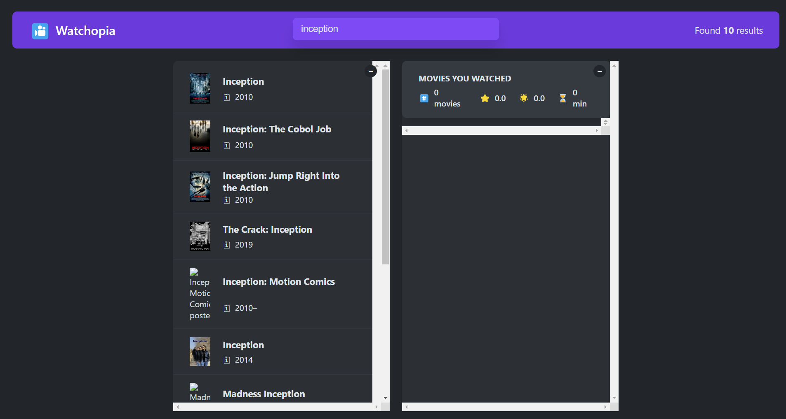
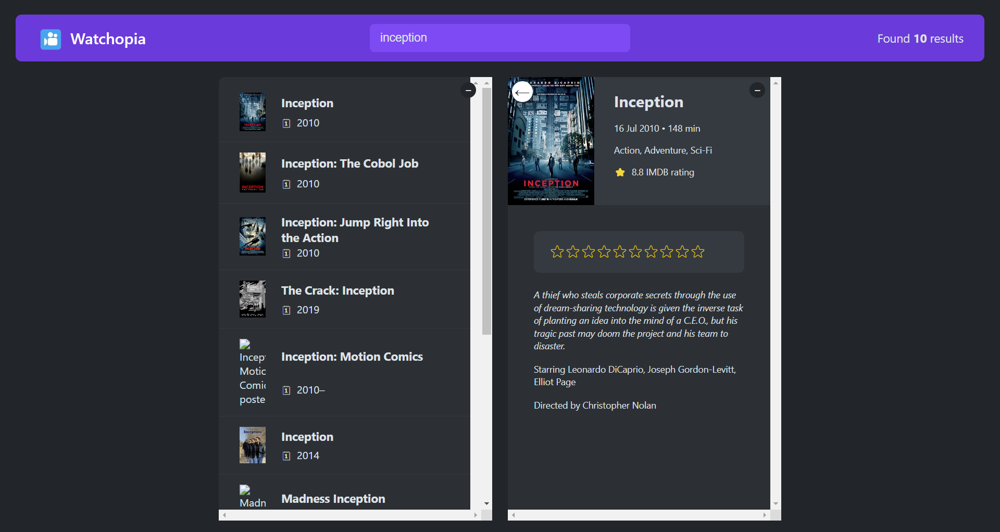
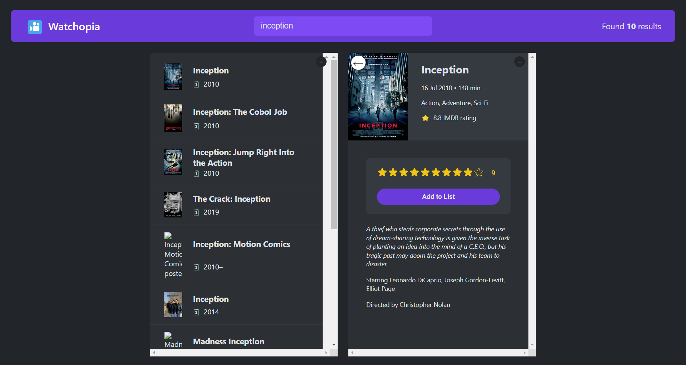
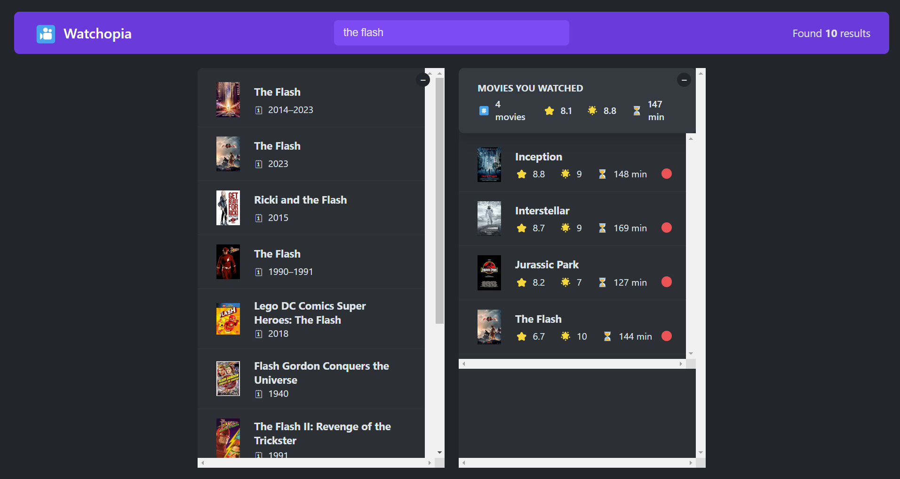

# Watchopia

## Description

Watchopia simplifies tracking watched movies and managing your movie list. Search, select, rate movies, and seamlessly organize your watched movies while enjoying a clear summary of your movie-watching history.

- [Inspiration](https://usepopcorn.netlify.app/)
- [OMDb API](https://www.omdbapi.com/)

## Features

- Real-time movie search functionality, displaying results directly from an API
- Detailed movie information upon selection, offering insights into your preferred movies
- Rate movies and add them to your watched list effortlessly
- Comprehensive summary view showcasing your watched movie collection
- Capability to remove movies from your watched list easily

## Getting Started

Follow these steps to set up and run the app on your local machine:

### Prerequisites

- Node.js: Make sure you have Node.js installed on your computer. You can download it [here](https://nodejs.org/).

### Installation

1. Clone this repository to your local machine.
   ```bash
   git clone https://github.com/niveditapagar/movie-buff-tracker.git
   ```
1. Navigate to the project directory.

   ```bash
   cd movie-buff-tracker
   ```

1. Install project dependencies.
   ```
    npm install
   ```

### Running the App

After installing the dependencies, you can run the app locally.

1. Start the development server.
   ```
   npm start
   ```
1. Open your web browser and visit http://localhost:3000 to use the app.

### Usage

- Search for movies in real-time using the provided search functionality.
- View detailed information about selected movies.
- Rate movies and add them to your watched list effortlessly.
- Get a comprehensive summary of your watched movies.
- Easily remove movies from your watched list.

### Screenshots

#### Search Movies



Real-time movie search with results fetched directly from the API.

#### Movie Details



Detailed view showcasing movie information upon selection.

#### Rating Selection and Add Movie



Easily rate movies and add them to your watched list with a simple click.

#### Watched Movies and Summary



Overview of your watched movies, helping you manage your movie-watching history.
